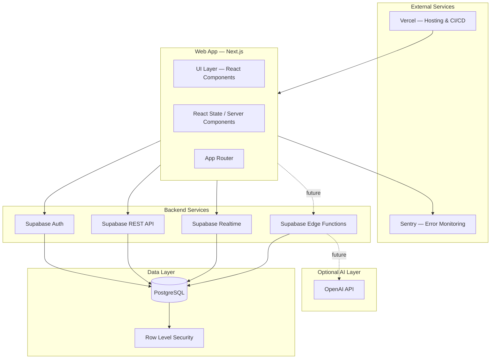
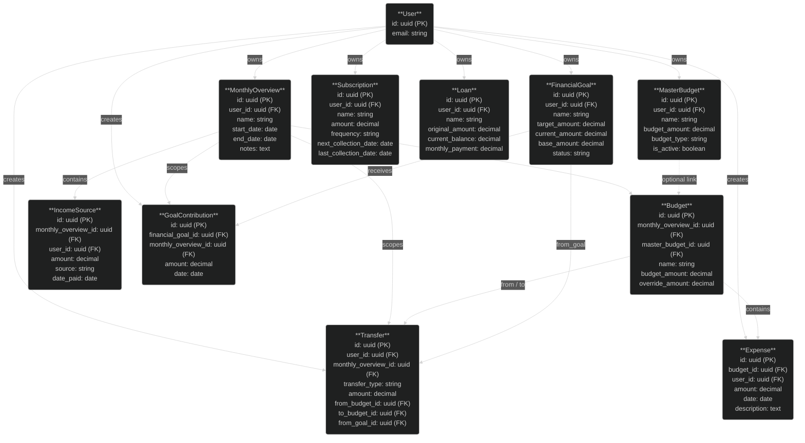
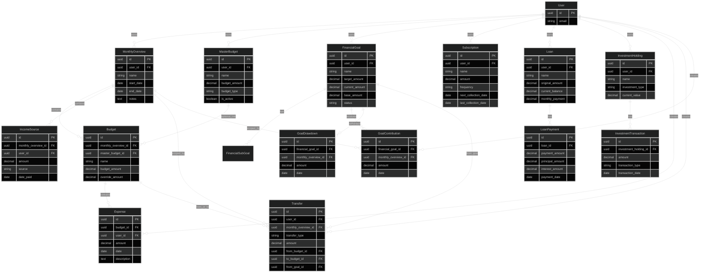
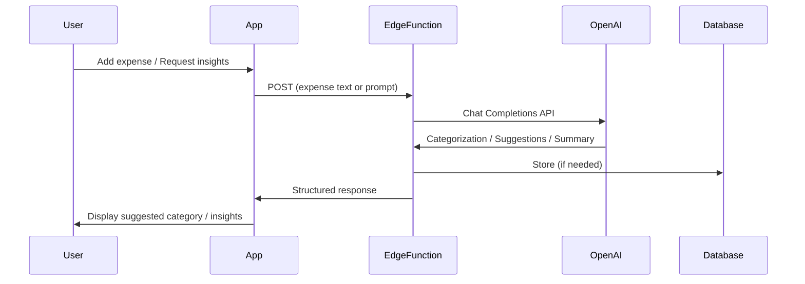

# MoneyApp — Architecture & Data Model

Technical overview of the MoneyApp family finance tracker: architecture, data model, optional AI integration, and implementation phases.

---

## 1. High-Level Architecture

**Components:**

| Layer | Technology | Purpose |
|-------|------------|---------|
| **Frontend** | Next.js 16, React 19 | App Router, Server/Client Components, routing |
| **State** | React hooks, Server Components | Local and server state |
| **Backend** | Supabase | Auth, REST, Realtime, PostgreSQL |
| **Hosting** | Vercel | Deployments, preview environments |
| **Monitoring** | Sentry | Error tracking |

---

## 2. Data Model (Core Entities)

### Entity Relationship Diagram

*Use dark theme in your Markdown viewer (e.g. VS Code Dark+) for a look similar to the card-style ER diagrams. Add `%%{init: {'theme':'dark'}}%%` before the diagram if your renderer supports it.*

#### Card-style diagram (core entities)

#### Full ER diagram (all entities)

### Core Entities (Detail)

**User** (auth.users)

| Attribute | Type | Description |
|-----------|------|-------------|
| `id` | uuid (PK) | User identifier |
| `email` | string | Login email |

**Relationships:** owns `MonthlyOverview`, `MasterBudget`, `FinancialGoal`, `Subscription`, `Loan`, `InvestmentHolding`; creates `Expense`, `Transfer`, `GoalContribution`.

---

**MonthlyOverview**

| Attribute | Type | Description |
|-----------|------|-------------|
| `id` | uuid (PK) | Primary key |
| `user_id` | uuid (FK) | References User |
| `name` | string | e.g. "January 2026" |
| `start_date` | date | Period start |
| `end_date` | date | Period end |
| `notes` | text | Optional notes |

**Relationships:** contains `Budget`, `IncomeSource`; scopes `Transfer`, `GoalContribution`.

---

**MasterBudget**

| Attribute | Type | Description |
|-----------|------|-------------|
| `id` | uuid (PK) | Primary key |
| `user_id` | uuid (FK) | References User |
| `name` | string | Category name |
| `budget_amount` | decimal | Default amount |
| `budget_type` | string | Fixed / Variable |
| `is_active` | boolean | Soft delete flag |

**Relationships:** optionally linked by `Budget` (master_budget_id).

---

**Budget**

| Attribute | Type | Description |
|-----------|------|-------------|
| `id` | uuid (PK) | Primary key |
| `monthly_overview_id` | uuid (FK) | References MonthlyOverview |
| `master_budget_id` | uuid (FK) | Optional link to MasterBudget |
| `name` | string | Category name |
| `budget_amount` | decimal | Allocated amount |
| `override_amount` | decimal | Optional override |

**Relationships:** contains `Expense`; participates in `Transfer` (from/to).

---

**Expense**

| Attribute | Type | Description |
|-----------|------|-------------|
| `id` | uuid (PK) | Primary key |
| `budget_id` | uuid (FK) | References Budget |
| `user_id` | uuid (FK) | References User |
| `amount` | decimal | Spend amount |
| `date` | date | Transaction date |
| `description` | text | Optional description |

**Relationships:** belongs to `Budget`.

---

**IncomeSource**

| Attribute | Type | Description |
|-----------|------|-------------|
| `id` | uuid (PK) | Primary key |
| `monthly_overview_id` | uuid (FK) | References MonthlyOverview |
| `user_id` | uuid (FK) | References User |
| `amount` | decimal | Income amount |
| `source` | enum | Salary, Freelance, etc. |
| `date_paid` | date | Payment date |

**Relationships:** belongs to `MonthlyOverview`.

---

**Transfer**

| Attribute | Type | Description |
|-----------|------|-------------|
| `id` | uuid (PK) | Primary key |
| `user_id` | uuid (FK) | References User |
| `monthly_overview_id` | uuid (FK) | References MonthlyOverview |
| `transfer_type` | enum | budget_to_budget, goal_to_budget, goal_drawdown |
| `amount` | decimal | Transfer amount |
| `from_budget_id` | uuid (FK) | Source budget (if applicable) |
| `to_budget_id` | uuid (FK) | Destination budget (if applicable) |
| `from_goal_id` | uuid (FK) | Source goal (if applicable) |

**Relationships:** scoped by `MonthlyOverview`; connects `Budget` and `FinancialGoal`.

---

**FinancialGoal**

| Attribute | Type | Description |
|-----------|------|-------------|
| `id` | uuid (PK) | Primary key |
| `user_id` | uuid (FK) | References User |
| `name` | string | Goal name |
| `target_amount` | decimal | Target amount |
| `current_amount` | decimal | Current balance |
| `base_amount` | decimal | Manual starting amount |
| `status` | enum | Not Started, In Progress, Completed, etc. |

**Relationships:** has `FinancialSubGoal`, receives `GoalContribution`, has `GoalDrawdown`; source of `Transfer` (goal_to_budget, goal_drawdown).

---

**GoalContribution**

| Attribute | Type | Description |
|-----------|------|-------------|
| `id` | uuid (PK) | Primary key |
| `financial_goal_id` | uuid (FK) | References FinancialGoal |
| `monthly_overview_id` | uuid (FK) | References MonthlyOverview |
| `amount` | decimal | Contribution amount |
| `date` | date | Contribution date |

**Relationships:** belongs to `FinancialGoal`, scoped by `MonthlyOverview`.

---

**Subscription**

| Attribute | Type | Description |
|-----------|------|-------------|
| `id` | uuid (PK) | Primary key |
| `user_id` | uuid (FK) | References User |
| `name` | string | Subscription name |
| `amount` | decimal | Recurring amount |
| `frequency` | enum | Weekly, Monthly, etc. |
| `next_collection_date` | date | Next payment date |
| `last_collection_date` | date | Last payment date |

**Relationships:** owned by `User`.

---

**Loan**

| Attribute | Type | Description |
|-----------|------|-------------|
| `id` | uuid (PK) | Primary key |
| `user_id` | uuid (FK) | References User |
| `name` | string | Loan name |
| `original_amount` | decimal | Initial principal |
| `current_balance` | decimal | Outstanding balance |
| `monthly_payment` | decimal | Regular payment |

**Relationships:** has `LoanPayment`.

---

## 3. AI Integration Flow (Optional / Future)

The app does not currently use AI. Below is a possible design if AI features are added.

### Sequence Diagram

### Potential AI Features

| Feature | Flow | Storage |
|---------|------|---------|
| **Expense categorization** | User enters raw text → LLM suggests category and sub_category | Writes to `expenses` |
| **Budget insights** | User requests summary → LLM analyzes spending vs budgets | Ephemeral (or stored in new table) |
| **Spending trends summary** | Cron job runs weekly → LLM generates narrative from trend data | Stored or returned on demand |
| **Coaching chatbot** | User asks question → Chat Completions returns advice | No persistent storage unless added |

---

## 4. Implementation Phases

### Phase 1: Foundation

**Scope:** Project setup, auth, base data model.

**Deliverables:**
- Next.js app with App Router
- Supabase project and schema (monthly_overviews, budgets, expenses, income_sources)
- Auth (email/password, OAuth)
- RLS policies
- Basic navigation and layout

---

### Phase 2: Core Budget Features

**Scope:** Monthly planning, budgets, expenses, income.

**Deliverables:**
- CRUD for monthly overviews
- CRUD for budgets and expenses
- Income source management
- `budget_summary` and `monthly_overview_summary` views
- Dashboard with totals and charts

---

### Phase 3: Goals & Transfers

**Scope:** Goals, contributions, drawdowns, transfers.

**Deliverables:**
- `financial_goals` and `financial_sub_goals`
- `goal_contributions` and `goal_drawdowns`
- `transfers` (budget↔budget, goal→budget, goal drawdown)
- Goal funding and drawdown flows
- Unallocated amount including goal contributions

---

### Phase 4: Master Budgets & Recurring

**Scope:** Reusable categories, subscriptions, loans.

**Deliverables:**
- `master_budgets` with Fixed/Variable types
- Budget linking to master budgets
- Subscriptions CRUD and next payment logic
- Loans and loan payments
- Trends for master budget categories

---

### Phase 5: Investments & Hardening

**Scope:** Investments, polish, production readiness.

**Deliverables:**
- `investment_holdings` and `investment_transactions`
- Export, filters, bulk actions
- Sentry, Vercel deployment, monitoring
- E2E tests and documentation

---

## 5. Views & Computed Fields

| View | Purpose |
|------|---------|
| **monthly_overview_summary** | Income, budgeted, spent, unallocated per month |
| **budget_summary** | Per-budget: spent, remaining, % used (including transfers) |
| **investment_holding_summary** | Invested, withdrawn, net, gain/loss per holding |

---

## 6. How to View the Diagrams

- **GitHub / GitLab:** Mermaid renders in Markdown preview.
- **VS Code:** Use "Markdown Preview Mermaid Support" or "Mermaid" extension.
- **Card-style look (like the reference screenshot):** Paste the diagram into [mermaid.live](https://mermaid.live), then use the theme selector (top-right) and choose **Dark** for a dark background with light entity cards.
