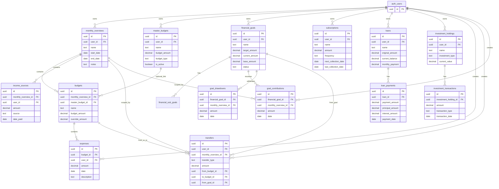
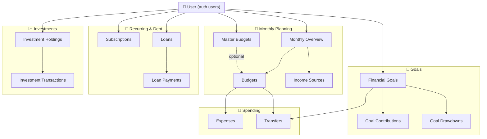

# MoneyApp Data Model

This document describes the database schema and relationships for the MoneyApp family finance tracker.

---

## Overview

The app is built on **Supabase** (PostgreSQL) with **Row Level Security (RLS)** enforcing that users only access their own data. All core entities are scoped by `user_id` referencing `auth.users`.

The model is organized around:

1. **Monthly planning** — Budget periods, categories, and income
2. **Spending** — Expenses and transfers between budgets/goals
3. **Goals** — Savings goals with contributions and drawdowns
4. **Recurring & debt** — Subscriptions and loans
5. **Investments** — Holdings and transactions

---

## Entity Relationship Diagram



---

## Simplified Visual: Core Flow



---

## Table Reference

### 1. Monthly Planning

| Table | Description | Key Columns |
|-------|-------------|-------------|
| **monthly_overviews** | A budget period (e.g. "January 2026"). Central planning unit. | `user_id`, `name`, `start_date`, `end_date` |
| **master_budgets** | Reusable category templates (Fixed/Variable). Baseline amounts. | `user_id`, `name`, `budget_amount`, `budget_type` |
| **budgets** | Category per month. Optional link to `master_budgets`. | `monthly_overview_id`, `master_budget_id`, `budget_amount`, `override_amount` |
| **income_sources** | Income for a month. | `monthly_overview_id`, `amount`, `source`, `date_paid`, `tithe_deduction` |

### 2. Spending

| Table | Description | Key Columns |
|-------|-------------|-------------|
| **expenses** | Individual spend within a budget. | `budget_id`, `user_id`, `amount`, `date`, `description` |
| **transfers** | Unified transfers: budget↔budget, goal→budget, goal drawdown. | `transfer_type`, `amount`, `from_budget_id`, `to_budget_id`, `from_goal_id` |

### 3. Goals

| Table | Description | Key Columns |
|-------|-------------|-------------|
| **financial_goals** | Savings goals. | `user_id`, `name`, `target_amount`, `current_amount`, `base_amount`, `status` |
| **financial_sub_goals** | Sub-goals within a goal. | `financial_goal_id`, `name`, `estimated_cost`, `progress` |
| **goal_contributions** | Funding into goals (per month). | `financial_goal_id`, `monthly_overview_id`, `amount`, `date` |
| **goal_drawdowns** | Withdrawals from goals. New flows use `transfers` instead. | `financial_goal_id`, `monthly_overview_id`, `amount`, `date` |

### 4. Recurring & Debt

| Table | Description | Key Columns |
|-------|-------------|-------------|
| **subscriptions** | Recurring subscriptions. | `user_id`, `name`, `amount`, `frequency`, `next_collection_date`, `last_collection_date` |
| **loans** | Loans and debts. | `user_id`, `name`, `original_amount`, `current_balance`, `monthly_payment`, `status` |
| **loan_payments** | Loan payments. | `loan_id`, `payment_amount`, `principal_amount`, `interest_amount`, `payment_date` |

### 5. Investments

| Table | Description | Key Columns |
|-------|-------------|-------------|
| **investment_holdings** | Investment positions. | `user_id`, `name`, `investment_type`, `current_value` |
| **investment_transactions** | Buys, sells, dividends. | `investment_holding_id`, `amount`, `transaction_type`, `transaction_date` |

### 6. Audit & Config

| Table | Description |
|-------|-------------|
| **budget_history** | Audit log for budget changes. |
| **master_budget_history** | Audit log for master budget changes. |
| **app_settings** | App configuration. |

---

## Views (Computed Fields)

| View | Purpose |
|------|---------|
| **monthly_overview_summary** | Totals: income, budgeted, spent, unallocated. |
| **budget_summary** | Per-budget: `amount_spent`, `amount_left`, `percent_used`, including transfers. |
| **investment_holding_summary** | Per-holding: `total_invested`, `total_withdrawn`, `net_invested`, `gain_loss`. |

---

## Transfer Types

The `transfers` table supports three kinds of moves:

| Type | Description | Required Columns |
|------|-------------|------------------|
| `budget_to_budget` | Move from one budget to another. | `from_budget_id`, `to_budget_id` |
| `goal_to_budget` | Fund a budget from a goal. | `from_goal_id`, `to_budget_id` |
| `goal_drawdown` | Withdraw from goal (e.g. into a DrawDown budget). | `from_goal_id` |

---

## Goal Balance Calculation

```
current_amount = base_amount + SUM(goal_contributions) - SUM(goal_drawdowns) - SUM(transfers WHERE from_goal_id)
```

---

## Enums (Value Sets)

| Enum | Values |
|------|--------|
| `bank_type` | AIB, Revolut, N26, Wise, Bank of Ireland, Ulster Bank, Cash, Other |
| `person_type` | Kene, Ify, Joint, Other |
| `frequency_type` | Weekly, Bi-Weekly, Monthly, Quarterly, Bi-Annually, Annually, One-Time |
| `status_type` | Not Started, In Progress, On Hold, Completed, Cancelled |
| `subscription_status_type` | Active, Paused, Cancelled, Ended |
| `goal_type` | Short Term, Medium Term, Long Term |
| `income_source_type` | Salary, Freelance, Side Hustle, Investment, Gift, Refund, Other |
| `expense_sub_category_type` | Rent, Electricity, Groceries, Transport, etc. |
| `transfer_type` | budget_to_budget, goal_to_budget, goal_drawdown |
| `loan_status_type` | Active, Paid Off, Defaulted, Refinanced, Closed |
| `loan_type` | Mortgage, Car Loan, Personal Loan, Student Loan, Credit Card, Other |

---

## Row Level Security (RLS)

All tables use RLS. Access is based on:

- **Direct ownership**: `auth.uid() = user_id` (expenses, goals, subscriptions, etc.)
- **Indirect ownership**: Via `monthly_overviews` for budgets, or via `financial_goals` for sub-goals

---

## How to View the Diagram

- **GitHub/GitLab**: Mermaid diagrams in this markdown render automatically.
- **VS Code**: Use the "Markdown Preview Mermaid Support" extension.
- **Online**: Paste the Mermaid block into [mermaid.live](https://mermaid.live).
